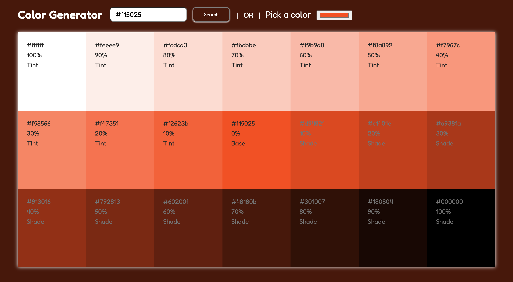

# Color Generator

Color Generator Website allows the user to search for a specific color using hex code/rgb/rgba/hsl/hsla values or color name and get all the tint, shade and base value of the color by the weight of 10.

## Table of contents

- [Overview](#overview)
  - [The challenge](#the-challenge)
  - [Screenshot](#screenshot)
  - [Links](#links)
- [My process](#my-process)
  - [Built with](#built-with)
- [Author](#author)

### The challenge

Users should be able to:

- View the optimal layout for the site depending on their device's screen size
- See hover states for all interactive elements on the page
- Search for the color shades, tints and base color using the hex code/rgb/rgba/hsl/hsla values or color name
- See all the tint, shade and base value of the color by the weight of 10
- Select a color from the color picker and see all the tints and shades of the color, and the base color using it.
- Copy a color code using the Eye Dropper in the color picker and all the tints and shades of the color, and the base color using it. This project was built for the final project of CS50x, Introduction To Computer Science.

### Screenshot

### Links

- Solution URL: [https://github.com/krrish105/color-generator](https://github.com/krrish105/color-generator)
- Live Site URL: [Add live site URL here](https://your-live-site-url.com)

## My process

### Built with

- Semantic HTML5 markup
- CSS custom properties
- Flexbox
- CSS Grid
- Mobile-first workflow
- [React](https://reactjs.org/) - JS library
- [Values.js](https://github.com/noeldelgado/values.js)
- [styled-components](https://styled-components.com/)

## Author

- Frontend Mentor - [Krrish105](https://www.frontendmentor.io/profile/Krrish105)
- Twitter - [@\_karishma10](https://twitter.com/_karishma10)
- LinkedIn - [Karishma Garg](https://www.linkedin.com/in/karishma-garg-)
- CodePen - [Krrish105](https://codepen.io/krrish105)
